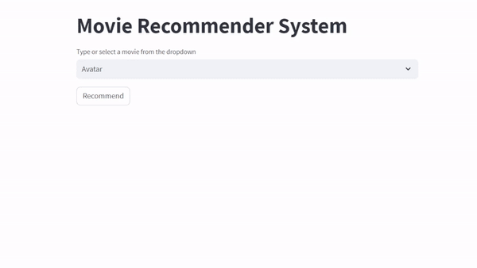

## Moive Recommendation System

  

Recommendation website made with Streamlit, based on [TMDB 5000 Movie Dataset
](https://www.kaggle.com/datasets/tmdb/tmdb-movie-metadata)

- Due to the large size of `movie_list.pkl` and `similarity.pkl`, I compressed those file into binary file
- If you want to get `movie_list.pkl` and `similarity.pkl`, please run `movie-recommendation-system.ipynb`
